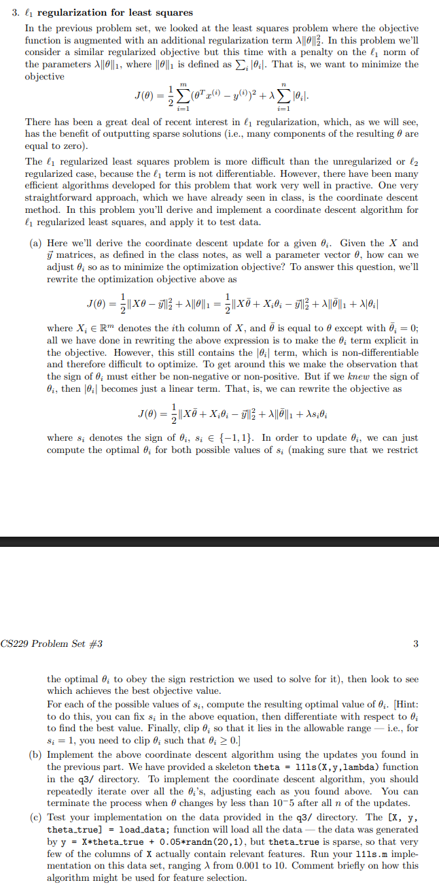

# ℓ1 Regularization for Least Squares

This is part of a homework assignment from cs229 (HW3,#3, at https://see.stanford.edu/course/cs229). The problem involves implementing a coordinate descent algorithm for ℓ1-regularized least squares. This python implementation is for parts (b) and (c) of the problem and uses the provided data from the course to test it. 

---

