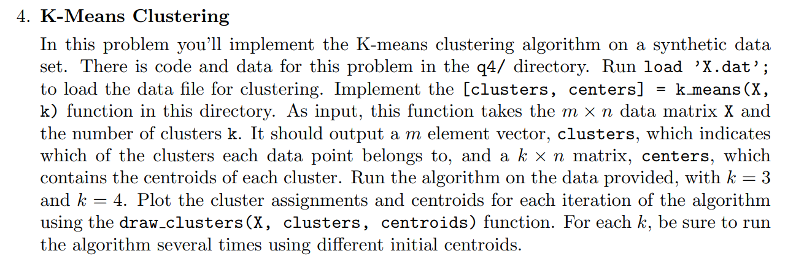

# K-Means Clustering (CS229 HW3 - Problem 4)

This project contains a Python implementation of the K-Means clustering algorithm for Problem 4 of CS229 Homework Set 3. The original problem asked for a basic implementation of K-Means and running it on a provided dataset (`X.dat`) for values `k=3` and `k=4`, plotting the resulting clusters and centroids for each iteration. A screenshot of the original problem is included in `problem.png`.

In addition to completing the original problem, this implementation also includes:
- K-Means++ centroid initialization for better performance
- Multiple restarts (`n_init`) to avoid poor local minima
- Code that generates and clusters simulated 2D Gaussian data for a range of k values (`k=2` through `k=8`)

Results are saved as plots in the `plots/` directory:
- `plots/cs229_data/` contains output plots for the CS229 dataset
- `plots/sim_data/` contains results from the simulated Gaussian data